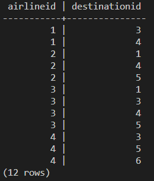
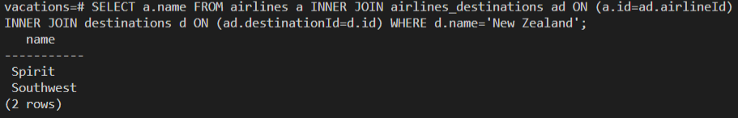
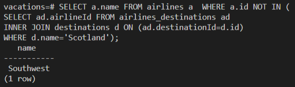
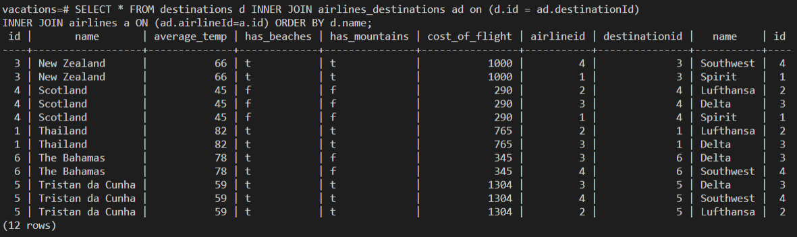

# database-checkpoint

**Challenge 1 - All of the vacation destinations.**

  * Query: vacations=# SELECT name  FROM destinations;
  * Result: 

**Challenge 2 - All destinations where you can swim at the beach.**
  * Query: vacations=# SELECT name FROM destinations WHERE has_beaches='true';
  * Result: 

**Challenge 3 - All destinations where the average temperature is over 60 degrees.**
  * Query: vacations=# SELECT name FROM destinations WHERE average_temp>60;
  * Result: 

**Challenge 4 - All destinations where you can swim at the beach AND go to the mountains.**
  * Query: vacations=# SELECT name FROM destinations WHERE has_beaches ='true' AND has_mountains='true';
  * Result: 

**Challenge 5 - All destinations where flights cost less than $500 and you can hike in the mountains.**
  * Query: vacations=# SELECT name FROM destinations WHERE cost_of_flight<500 AND has_mountains='true';
  * Result: 

**Challenge 6 - Add an entry for The Bahamas, where the average temperature is 78, it has beaches but no mountains, and the flights cost $345.**
  * Query: vacations=# INSERT INTO destinations(name, average_temp, has_beaches, has_mountains, cost_of_flight) VALUES('The Bahamas', 78, true, false, 345);
  * Result: 

**Challenge 7 - Turns out, the cost of flights to New Zealand has increased! Update New Zealand's entry for flight cost to $1000.**
  * Query: vacations=# UPDATE destinations SET cost_of_flight = 1000 WHERE name='New Zealand';
  * Result: 

**Challenge 8 - Turns out, Minnesota isn't a vacation destination. Please delete it from the database.**
  * Query: vacations=# DELETE FROM destinations WHERE name='Minnesota';
  * Result: 

**Challenge 9 - When the data set was written, the author mistakently wrote "England" when they actually meant "Scotland". Please update that entry in the database.**
  * Query: vacations=# UPDATE destinations SET name ='Scotland' WHERE name='England';
  * Result: 

**Challenge 10 - Create a join table that joins the airlines and the destinations tables by correlating which airlines fly to which destinations.**
  * Query: vacations=# CREATE TABLE airlines_destinations(airlineId INT REFERENCES airlines(id), destinationId INT REFERENCES destinations(id));
  * Query: vacations=# INSERT INTO airlines_destinations(airlineId, destinationId) VALUES (1,3), (1,4),(2,1),(2,4),(2,5),(3,1),(3,3),(3,4),(3,5),(4,3),(4,5),(4,6);
  * Result: 

**Challenge 11 - All airlines that fly to New Zealand.**
  * Query: vacations=# SELECT a.name FROM airlines a INNER JOIN airlines_destinations ad ON (a.id=ad.airlineId) INNER JOIN destinations d ON (ad.destinationId=d.id) WHERE d.name='New Zealand';
  * Result: 

**Challenge 12 - All airlines that do NOT fly to Scotland.**
  * Query: vacations=# SELECT a.name FROM airlines a  WHERE a.id NOT IN (SELECT ad.airlineId FROM airlines_destinations ad INNER JOIN destinations d ON (ad.destinationId=d.id) WHERE d.name='Scotland');
  
  OR

  * Query: vacations=# SELECT a.name FROM airlines a LEFT OUTER JOIN airlines_destinations ad ON (a.id=ad.airlineId) AND ad destinationId=4 WHERE ad.airlineId IS NULL;

  * Result: 

**Challenge 13 - All of the data for all vacation destinations.**
  * Query: vacations=# SELECT * FROM destinations d INNER JOIN airlines_destinations ad ON (d.id = ad.destinationId) INNER JOIN airlines a ON (ad.airlineId=a.id) ORDER BY d.name;
  * Result: 

